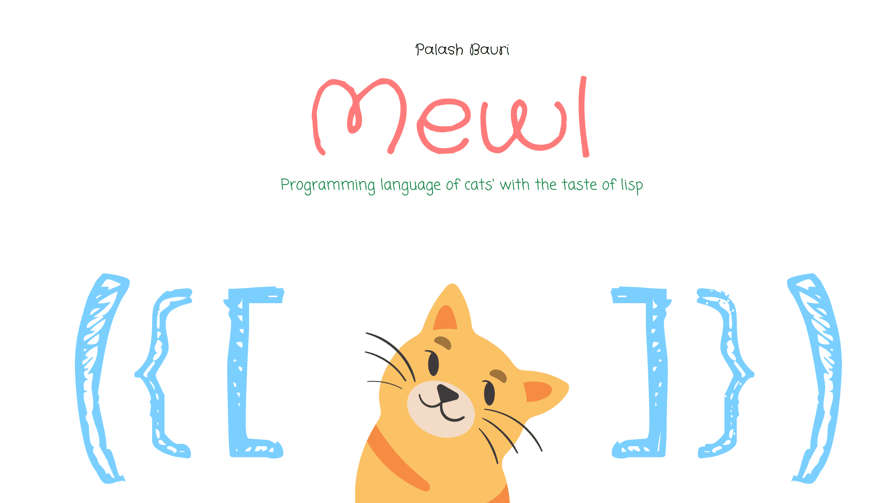

# 

# Mewl

##### The programming language of cats' with the taste of lisp

## 🤔 What,Why?

Well, 2 years ago in 2020, I created a esoteric programming language called [Mewmew](https://github.com/bauripalash/mewmew). It was just a fun and experimental language I made while tinkering with ANTLR, cause I was (am still) fascinated about programming languages, interpreter/compilers; how they work; how they basically become the medium of interaction between humans and computers and/or machines. But with ANTLR, I didn't actually learn much about compiler/interpreter construction. It just worked! No fun!

So, In the October of 2021, I started re-writing the whole thing from scratch with Rust. I was able to build a lexer; a basic parser; But then I realized, syntax of 'mewmew' is ugly. I hurts my eyes to look at a 'mewmew' source code.

Again in, March 2022, I started experimenting with mewmew lanugage but with lisp style syntax, 'cause lisp is awesome. So, here is the result, **Mewl** , mewmew reborn with the syntax similar to lisp. Most important thing, I am having fun while developing mewl, and the syntax doesn't hurt my eyes that much. 

## 🎉 Get Started

### Basic Syntax

```lisp
;; mew is equivalent to 1
;; mewmew is equivalent to 2
;; mewmewmewmewmew is equivalent to 5
;; [- mew mew] is equivalent to 0


(:: [+ mew mew]) ;; prints 2
;; :: -> is a symbol/function to print the next atoms/expressions to stdout

TODO: More examples
```

## Some builtin capabilities

```lisp
+ -> Addition
- -> Substraction
* -> Multiplication
/ -> Division
:: -> Print to stdout
::: -> Assumes next expressions/atom as byte value. convert them to string, including invalid chars and prints to stdout

TODO:: Add more
```
[](https://github.com/bauripalash/mewl/actions/workflows/rust.yml)
